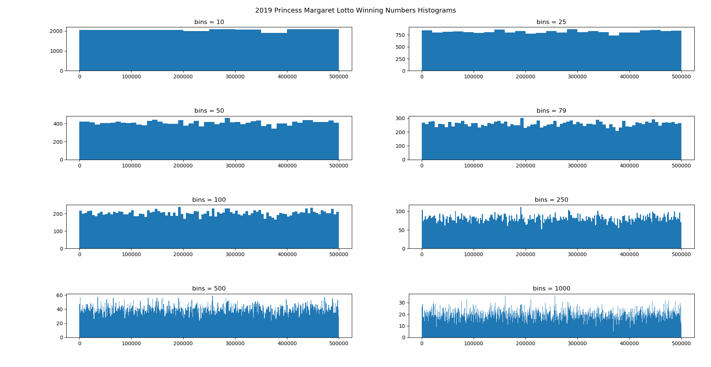
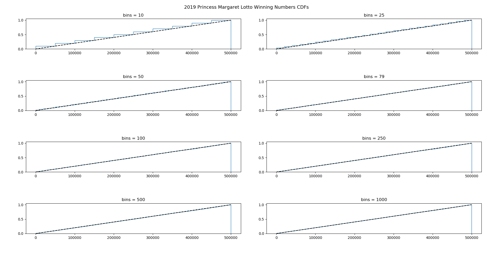

# 2019-pml-statistics
unscientific pseudostatistical analysis of the 2019 Princess Margaret Lottery winning numbers

# Results





```
Mean: 250396.27391559776, expected: 250000.0
Variance: 20980066194.838654, expected: 20833416666.666668
Skewness: 0.0009002043642360459, expected: 0
Entropy: 9.89849316019326, expected: 9.924563878138045
Chi-squared: Power_divergenceResult(statistic=91.12914912366591, pvalue=0.1655297697130479)
```

Is there any reason to believe that the winning numbers are not uniformly distributed? Nah.

Am I pissed that I didn't win? Yes.

